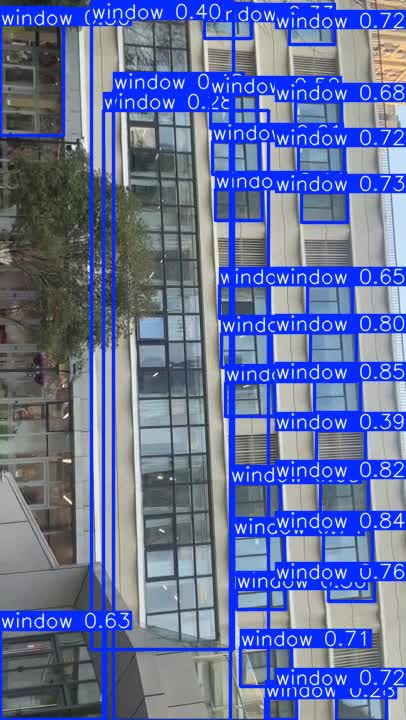

# Design of An Automatic Coil-Gun

**An engineering case study in electromechanical prototyping, embedded control, and computer-vision integration**

Project Kuroko explored an electromagnetic-launcher prototype incorporating a mobile platform, a pan/tilt mechanism, and visual sensing. This repository documents physical construction, mechanical revisions, subsystem experiments, software integration, and the limits of the available evidence.

The public material focuses on engineering analysis and development history. Detailed launcher construction instructions, energy-system schematics, ballistic compensation, and operational targeting or firing code are excluded.

**Project period:** 2024 - June 2026. Michael's current research CV reports completion of prototype assembly and written documentation by June 2026. This is a completion statement, not a quantitative validation of overall performance.

## Michael Lu's contribution

Michael performed most of the physical building and system integration, led the final system architecture, developed the Arduino-side work, iterated the CAD designs, and conducted testing. He also refined AI-assisted integration code while working through hardware and software compatibility problems.

A collaborator helped originate the project. Michael's research CV names Tony Chen and mentor Huajie Ke as contributors to planning, discussion, and problem-solving. The original project statement does not explicitly identify the origin collaborator by name. The presentation credits **Michael Lin** with training the YOLO model used in the project. Michael's CV also records that he trained an initial model, identified its limitations, and adapted a working collaborator-trained model. His contribution should not be interpreted as sole authorship of the final model or its training pipeline. See [attribution](ATTRIBUTION.md).

## System architecture

| Subsystem | Documented role |
| --- | --- |
| OpenMV | Image acquisition and earlier color-based detection experiments |
| Raspberry Pi | Image processing and YOLO inference |
| Arduino | Embedded control and pan/tilt actuation |
| Mechanical assembly | Pan/tilt support, component mounting, and mobile chassis |
| Bluetooth interface | Remote communication used in subsystem development |
| Experimental launcher | Separately documented historical experiments |

These responsibilities emerged through successive prototypes. The source archive contains multiple implementations and should not be read as one verified final software release. The [architecture account](docs/system-architecture.md) distinguishes subsystem progress from complete-system validation.

## Engineering process and design iterations

Early rail-based experiments exposed difficulties with electrical contact, friction, heating, and mechanical alignment. The project subsequently explored a coil-based approach.

Michael's resume and CV identify Fusion 360 and Rhino for mechanical modeling and EasyEDA for circuit diagrams. Mechanical development included repeated pan/tilt designs and revisions to component supports, chassis construction, and packaging. The project log records fabrication and assembly issues alongside proposed changes, showing how physical constraints influenced the design.

Initial OpenMV experiments used color-based detection, which depended on lighting conditions and threshold selection. Later work moved inference to a Raspberry Pi while retaining OpenMV for image acquisition. Integration work addressed image orientation, communication between devices, control direction, and differences between development images and the deployed camera feed. The records also document failures and incomplete tests.

Read the [development history](docs/development-history.md) and [design iterations](docs/design-iterations.md).

## Controls and vision integration

The controls work explored image-based positioning of a pan/tilt mechanism. The presentation compares fixed-step adjustment with PID-based experiments and includes short sequences of observed error values. These observations document iteration, but do not establish a general tracking-accuracy or stability benchmark. The records lack the timestamps, repeated trials, and defined evaluation conditions needed for those claims.

The window-detection material documents annotation conversion, augmentation, and qualitative testing. It reports difficulties with large windows and later improvement after additional training. Quantitative detection performance remains unverified in the supplied evidence.

*From presentation slide 13. Boxes and displayed scores are model outputs, not ground truth or an accuracy metric. The presentation credits Michael Lin for model training; the screenshot capture author is unspecified. See [media provenance](media/credits.md).*

See [controls and vision](docs/controls-and-vision.md) and [model provenance](docs/vision-provenance.md).

## Experimental results and limitations

| Observation | Evidence status |
| --- | --- |
| Approximately 7.5 m/s in an early experiment | Indirect estimate recorded in the project log; uncertainty and repeatability are not established |
| Short control-error sequences approaching the image center | Presentation observations rather than a comprehensive benchmark |
| Vision and Arduino control operating together | Documented integration milestone followed by further troubleshooting |
| Improved recognition of large windows | Qualitative report; no verified accuracy benchmark |
| Complete system performance | Not established by a repeatable end-to-end test report in the supplied archive |

A later, higher velocity estimate is excluded from validated results because the underlying record does not establish a reliable measurement. The proposed firefighting application remained a concept; the materials do not demonstrate fire suppression or operational readiness.

The [experimental summary](results/experimental-summary.md), [control observations](results/control-observations.md), and [evidence register](results/evidence-and-limitations.md) record sources and qualifications.

## Repository contents

- `docs/` - architecture, development history, design decisions, and vision provenance.
- `results/` - experimental observations, source references, and measurement limitations.
- `media/` - a selected presentation screenshot and provenance notes.
- `examples/` - an isolated [Bluetooth serial bridge](examples/bluetooth_serial_bridge/README.md).

This documentation release does not include a complete runnable system, model weights, raw experimental datasets, or CAD fabrication files.

## Attribution and reuse

See [ATTRIBUTION.md](ATTRIBUTION.md) and [THIRD_PARTY_NOTICES.md](THIRD_PARTY_NOTICES.md). No blanket open-source or media license is asserted for the supplied materials. AI-assisted code development is acknowledged alongside Michael Lu's work on refinement, physical integration, and testing.
